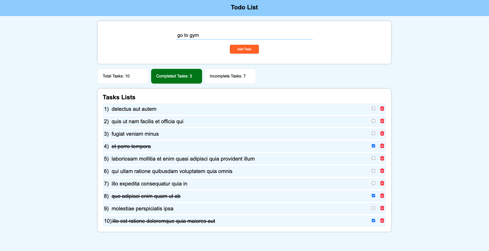
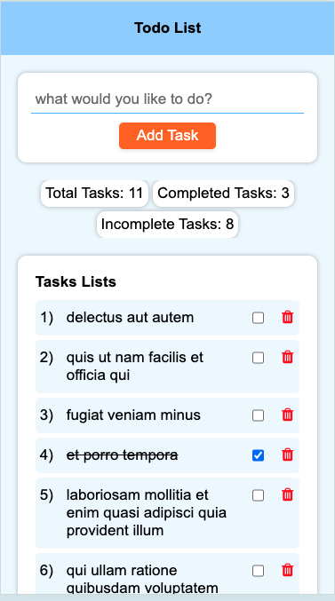

#Todo List

##Features
-  Utilize the JSONPlaceholder API to fetch 10 todos and display them in the application.
- Input field in the application to allow users to add more todos.
- Delete Icon: Allows users to remove the todo from the list.
- Checkbox: Enables users to mark the todo as complete.
- Bonus Features
  - Total Todo Count: Display the total number of todos in the list.
  - Incomplete Todo Count: Display the number of incomplete todos.
  - Complete Todo Count: Display the number of completed todos.

